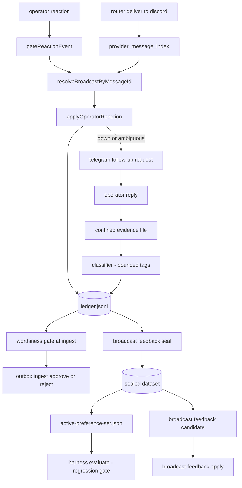

# Operator broadcast feedback

The operator marks a delivered broadcast with `👍` or `👎` in Discord. The host
records that mark, asks for detail when needed, and later turns the record into
one manual tuning candidate. Binding decision:
[ADR 043](../adr/043-operator-broadcast-feedback.md).

## Flow

## Parts

| Part | File | Role |
|---|---|---|
| Message index | `src/router/message-index.ts` | Maps a Discord message id to delivery, event, and part |
| Listener | `src/discord/broadcast-feedback-listener.ts` | Gates reactions and applies the live reaction set |
| Intake | `src/broadcast-feedback/intake.ts` | One record per event, idempotent transitions |
| Store | `src/broadcast-feedback/store.ts` | Append-only ledger and pending requests under one lock |
| Notify | `src/broadcast-feedback/notify.ts` | Sends one Telegram detail request |
| Follow-up | `src/broadcast-feedback/followup.ts` | Confines the reply, classifies it, records tags |
| Aggregate | `src/broadcast-feedback/aggregate.ts` | Seals preference pairs and policy examples |
| Worthiness examples | `src/broadcast-feedback/worthiness-examples.ts` | Loads live 👍/👎 delivered text for the worthiness gate |
| Candidate | `src/broadcast-feedback/candidate.ts` | Proposes, evaluates, applies, or dismisses one change |
| Harness view | `src/harness/operator-preference.ts` | Reads the sealed set and blocks regressions |

## States

`up`, `down`, `ambiguous` (both marks), and `retracted` (no marks). `down` and
`ambiguous` open one detail request. A later `up` cancels an open request. A
request expires after 72 hours and the reaction stays. `retracted` and broadcasts
with no reaction are a no-op — they never enter liked or disliked examples.

## Runtime worthiness influence

When `broadcast.feedback.enabled` is true, each outbox ingest loads the latest
👍 and 👎 records from the ledger (within `broadcast.feedback.history_days`),
resolves delivered broadcast text from the router database, and passes bounded
examples into the host worthiness gate. The gate compares the candidate proposal
to those examples:

- `up` → liked example; lean approve when wording, narrative, or idea matches
- `down` or `ambiguous` → disliked example; lean reject when the candidate resembles it
- no reaction / `retracted` → excluded; no influence

Raw Telegram follow-up prose never enters worthiness. Bounded tags and derived
summaries from completed follow-ups may appear on disliked examples only.

Manual seal → candidate → apply remains the path for durable
`broadcast-output-tuning.json` and decision-policy changes.

## Tags

`tone`, `jargon`, `timing`, `accuracy`, `wrong-subject`, `too-long`,
`too-short`, `missing-context`, `other`. Only `accuracy` and `wrong-subject`
change decision policy. The rest shape copy guidance.

## Confinement

- Raw operator prose lives in one evidence file per reply, marked
  `untrusted-external`. It never enters the ledger, a prompt, or the harness.
- A candidate writes only `agent/skills/decision-policy/policy.json` and
  `config/broadcast-output-tuning.json`.
- `broadcast feedback apply` needs a clean repository and holds
  `repo-mutation.lock`. It never commits, pushes, or deploys.
- `src/harness` reads `sealed/active-preference-set.json` only. Static lint
  rejects any harness import of the live feedback store.

## Commands

| Command | Use |
|---|---|
| `tc broadcast feedback status` | Counts, open requests, latest dataset and candidate |
| `tc broadcast feedback ledger` | Recent records with state and tags |
| `tc broadcast feedback seal` | Build one sealed dataset and the active preference set |
| `tc broadcast feedback candidate` | Propose and evaluate one bounded change |
| `tc broadcast feedback apply <id>` | Write the two allowlisted files for review |
| `tc broadcast feedback dismiss <id>` | Mark a candidate as dismissed |
| `tc broadcast feedback reconcile` | Read live reactions after listener downtime |

## Setup

1. Set `DISCORD_OPERATOR_USER_ID` to your Discord user id.
2. Set `broadcast.feedback.enabled` and `broadcast.feedback.channel_id`. The
   channel must appear in `chat.discord.channel_ids`.
3. Give the bot View Channel, Read Message History, and Add Reactions in that
   channel.
4. Restart the router, then the Discord listener.

## Related

- [docs/architecture/router.md](router.md)
- [docs/architecture/discord-conversation.md](discord-conversation.md)
- [docs/architecture/harness-improvement.md](harness-improvement.md)
- `INV-B3`, `INV-B6`, `INV-S24`
