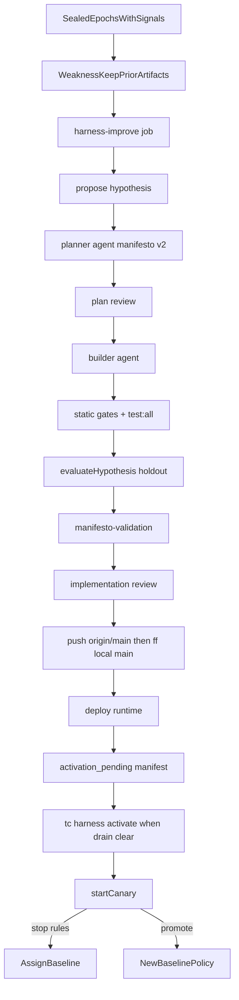
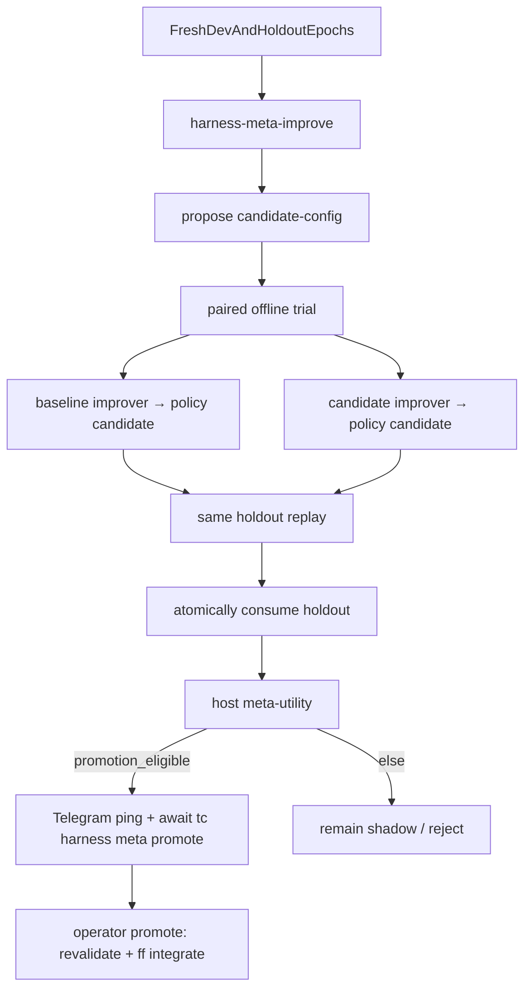

# Harness improvement loop

Not Relative Strength Index. Host-owned loops turn sealed audit scorecards into
falsifiable experiments — one **policy** candidate or one **meta** (improver-config)
candidate at a time, never both mid-flight under `one_active_experiment`.

Binding decisions: [ADR 005](../adr/005-harness-improvement.md) (policy),
[ADR 038](../adr/038-improver-self-edit-boundary.md) (no improver code/gates edit),
[ADR 039](../adr/039-bounded-improver-config-lane.md) (bounded shadow config lane).

## Policy flow

## Meta flow (ADR 039)

Shadow only until operator promotion: no integrate, deploy, agent sync, or canary
from the schedule path. Runtime reads checked-in / last-promoted
`config/harness-improver.json`.

## Artifacts

Under `~/.trenchcoat/harness-improvements/` (sibling of `archive/`):

| Path | Lane | Role |
|---|---|---|
| `<hypothesisId>/weakness-report.json` | policy | Clustered sealed failure patterns (host-mined) |
| `<hypothesisId>/keep-summary.json` | policy | Passing baseline behaviours to preserve |
| `<hypothesisId>/prior-attempts-summary.json` | policy | Compact negative-result digest for propose/plan |
| `<hypothesisId>/manifesto-validation.json` | policy | Plan manifesto vs holdout metrics (unpredicted protected regression fails) |
| `<hypothesisId>/…` | policy | hypothesis, plan, reviews, evaluation, journal, rejection |
| `prior-attempts.jsonl` | shared | Rebuildable index from rejection/rollback receipts |
| `meta/<candidateId>/` | meta | `candidate.json`, `candidate-config.json`, trial pairs, utility summary |
| `meta/<candidateId>/operator-notify.json` | meta | One-shot Telegram ping receipt when `promotion_eligible` |

Policy patches: literal `agent/skills/decision-policy/policy.json`.
Meta patches: literal `config/harness-improver.json` (repo-owned; never synced into
`agent/`). Unknown improver-config keys fail closed; no paths, commands, models,
floors, allowlists, or executable expressions (ADR 039 schema bounds).

## Inputs (sealed-only)

Propose / mining / keep / prior-attempts / meta trials may use:

- sealed epoch manifests + scorecard aggregates
- decision metadata / enums, numeric archived `signals`, host gate flags
- settled numeric decision outcomes (`outcomes/decision/<id>/<h>h.json`)

Never inbox, scraped card prose, or mutable workspace text (INV-S24).

## Scheduling

| Setting | Default | Meaning |
|---|---|---|
| `harness_improvement.enabled` | `true` | Master switch (policy CLI / canary) |
| `harness_improvement.schedule_enabled` | `true` | Allow `harness-improve` job / launchd |
| `harness_improvement.integrate_local_main` | `true` | Fast-forward local `main` after approval |
| `harness_improvement.push_origin` | `true` | Push candidate → `origin/main` before local ff |
| `harness_improvement.deploy_runtime` | `true` | Run install after integrate |
| `harness_improvement.defer_agent_activation` | `true` | Schedule stops at pending agent deploy |
| `harness_improvement.test_command` | `test:all` | `pnpm run <script>` in the worktree (after `pnpm install --frozen-lockfile`) |
| `harness_improvement.require_two_epochs` | `true` | Need distinct sealed epochs with decision-time signals |
| `harness_improvement.planner_model` / `reviewer_model` / `builder_model` | `composer-2.5` | Agent models |
| `harness_improvement.min_mature_paired` | `40` | Canary maturity floor |
| `harness_improvement.auto_open_pr` | `false` | Deprecated; PR path retired |
| `harness_improvement.meta_enabled` | `true` | Master switch for improver-config meta lane |
| `harness_improvement.meta_schedule_enabled` | `true` | Allow `harness-meta-improve` job |
| `harness_improvement.meta_min_paired_trials` | `8` | Operator hint; host utility floor is code-constant |
| `harness_improvement.meta_schedule_days` | `30` | Intended cadence for meta wakeups |
| `harness_improvement.meta_require_operator_promotion` | `true` | `tc harness meta promote` required |

Cadence: weekly policy (`harness-improve`, installed by default; `--without-harness`
to opt out) or `tc harness run`. Scheduled policy **never** activates the agent
workspace and **never** starts a canary — that is `tc harness activate <id>` after
drain. Meta (`harness-meta-improve` / `tc harness meta …`) may wake ~monthly or when
a fresh epoch pair appears; duplicate wakeups are no-ops via lock + trial ids.

Scheduled runs resolve the checkout via `TRENCHCOAT_REPO_ROOT` (set in
`~/.trenchcoat/env` by `install-launchd.sh`), then `process.cwd()`. Path must
contain both `.git` and `package.json` (`~/.trenchcoat/runtime` is not valid).
Sibling git worktrees used for candidates do **not** inherit the main
checkout's `node_modules`; host installs with `pnpm install --frozen-lockfile`
before any worktree `pnpm` test/gate script.

`evaluateHypothesis` replays the holdout through the candidate worktree policy
(with archived decision-time signals), compares the primary metric to the
development sealed scorecard, requires protected metrics not to regress, and
writes `manifesto-validation.json`.

### Meta-utility pass rule (non-configurable)

A meta candidate becomes `promotion_eligible` only when all hold (ADR 039 /
`computeMetaUtility`):

- ≥8 valid completed pairs (ties count for neither side)
- candidate ≥5 wins; candidate win rate > baseline
- candidate protected-regression and invalid-candidate counts no worse than baseline
- median signed primary improvement positive and no worse than baseline
- no safety/integrity failure

`promotion_eligible` ≠ activation. When a candidate first becomes eligible, the
host sends a one-shot Telegram operator ping (scorecard + exact
`trenchcoat harness meta status|promote|reject` next steps) and writes
`operator-notify.json` so later wakeups do not re-ping. Missing
`TELEGRAM_BOT_TOKEN` / `TELEGRAM_OPERATOR_ID` skips send without blocking the
lane; a failed send leaves no receipt so the next eligible wakeup retries.

`tc harness meta promote` revalidates cleanliness, candidate hash, eight trial
receipts, utility, confinement, and independent review, then ff-only
integrates/deploys. Revert = normal git revert + redeploy.

## Rules

- Patches limited to `policy.json` (policy) or `config/harness-improver.json` (meta).
  Forbidden: audit maths, router, chat, `src/harness/**` code/gates, contracts,
  secrets, launchd, holdout/meta-trial registries, allowlist constants.
- Candidate canaries may update watchlist/ledger after host validation; all
  external effects are blocked and receipted.
- One active experiment when `one_active_experiment` is true (policy or meta).
- Feature defaults **on** for new installs; explicit `false` survives migrate.
- Existing sealed epochs without decision-time `signals` are ineligible until new
  epochs accumulate — enabling the harness may initially produce typed skips.

## Idle gate (redeploy / restart)

`isAgentIdle` is true when nothing is mid-flight: live workspace lock (non-stale),
running incomplete archive runs, research `researching>0`, Telegram research
`running`, or Discord locks/running requests. `harness-improve` and
`harness-meta-improve` do **not** take `agent/.lock` (INV-S15 / ADR 027) so
continuous scans cannot starve them. Abandoned runs and backlog depth do **not**
block idle. `wait-idle` first fails orphaned incomplete journals (pre-seal + no
lock + ≥30m, or any running ≥6h).

`ops/install-launchd.sh` / `ops/install-systemd.sh` set a deploy pause, stop
scheduled jobs, wait for idle (default 30m), reload, then clear pause and
kickstart deferred jobs. Abort restores schedulers; pause files older than 45m
auto-clear. While paused, `runJob` exits 3. Escape hatch: `--skip-agent-wait`.
Operator probe: `tc harness wait-idle`.

## Drain gate (agent activation)

Full all-work clear requires idle **plus**: lock not stale; research actionable
`=0`; no Telegram confirmations; alpha queue empty; Discord queued/undelivered
clear; no pending X actions; router ingress empty. Abandoned incomplete runs do
not block.

`tc harness activate <id>` waits for idle (unless `--no-wait`), then rechecks the
full drain under the writer lock, syncs only approved instruction paths (never
state/inbox/outbox/reports/alpha-queue), then starts the bounded canary.

## CLI

| Command | Effect |
|---|---|
| `tc run harness-improve` / `tc harness run` | Policy pipeline → `activation_pending` |
| `tc harness propose --epoch <id>` | Emit one hypothesis from sealed scorecard (+ mining artifacts) |
| `tc harness prepare <id>` | Create confined worktree (after plan approval) |
| `tc harness evaluate <id> --dev-epoch … --holdout-epoch …` | Offline holdout + manifesto gates |
| `tc harness wait-idle` | Block until in-flight work finishes |
| `tc harness drain [--wait]` | Print all-work drain snapshot (optional idle wait) |
| `tc harness activate <id>` | Idle-wait + drain-gated agent sync + start canary |
| `tc harness canary start\|stop` | Bounded-live assignment |
| `tc harness promote <id>` | Record policy promotion after maturity |
| `tc harness rollback --reason …` | Force baseline assignment |
| `tc run harness-meta-improve` | Shadow meta propose/trial step (no promote) |
| `tc harness meta propose` | Propose improver-config candidate |
| `tc harness meta trial --candidate <id> --dev-epoch … --holdout-epoch …` | One paired offline trial |
| `tc harness meta status` | Candidate / utility / trial summary |
| `tc harness meta promote <id>` | Operator-only integrate after `promotion_eligible` |
| `tc harness meta reject <id>` | Mark meta candidate rejected |

## Failure / resume

- Typed skips (lock held, missing epochs/signals, active canary, mid-flight peer
  lane, cadence) persist schedule reports and exit without mutating allowlists.
- Policy journal advances through discrete phases; crash mid-pipeline leaves the
  hypothesis dir + rejection receipts for the next run / operator inspect —
  do not reuse a consumed holdout.
- Meta: each trial consumes its holdout atomically after both baseline and
  candidate policy candidates are frozen; failed mid-trial does not mark the
  holdout consumed. Re-running with the same open `proposed`/`trialing`
  candidate resumes trials rather than spawning duplicates.
- Prior-attempts index is host-built and rebuildable from rejection/rollback
  receipts if the jsonl is lost.
- Kill switches: `enabled` / `schedule_enabled` / `meta_*`; `push_origin: false`
  keeps integrate local-only; `meta_require_operator_promotion: true` refuses
  auto-promote paths.

## Related

- Audit spine: [audit-metrics.md](audit-metrics.md), [orchestrator.md](orchestrator.md),
  [snapshot-archive.md](snapshot-archive.md) (decision outcomes)
- Invariants: INV-S23, INV-S24, INV-S25; lock exemption INV-S15 / ADR 027
- Discord chain-registry automation is a **separate** lane (INV-S26 / ADR 016);
  it must not widen harness allowlists. Both lanes may host-push ff-only updates
  to `origin/main` under `repo-mutation.lock`.
- Agent workspace sync boundary: [agent-workspace.md](agent-workspace.md)
- Research alignment: [harness-self-improvement-patterns.md](../knowledge/harness-self-improvement-patterns.md)
