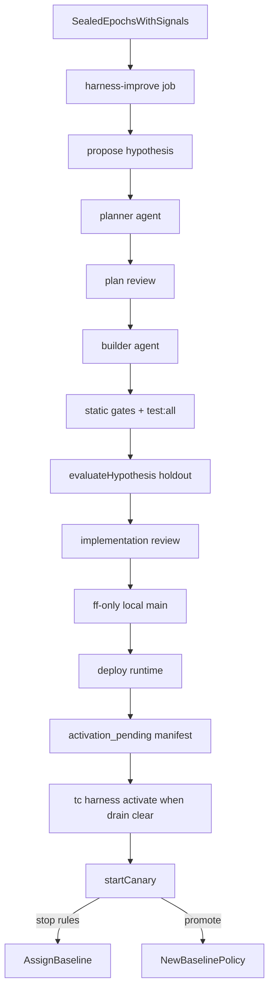

# Harness improvement loop

Not Relative Strength Index. This module turns sealed audit scorecards into
**one** falsifiable decision-policy experiment at a time.

Binding decision: [ADR 005](../adr/005-harness-improvement.md).

## Flow

## Scheduling

| Setting | Default | Meaning |
|---|---|---|
| `harness_improvement.enabled` | `true` | Master switch |
| `harness_improvement.schedule_enabled` | `true` | Allow `harness-improve` job / launchd |
| `harness_improvement.integrate_local_main` | `true` | Fast-forward local `main` after approval |
| `harness_improvement.deploy_runtime` | `true` | Run `ops/install-launchd.sh` after integrate |
| `harness_improvement.defer_agent_activation` | `true` | Schedule stops at pending agent deploy |
| `harness_improvement.test_command` | `test:all` | `pnpm run <script>` in the worktree |
| `harness_improvement.require_two_epochs` | `true` | Need distinct sealed epochs with decision-time signals |
| `harness_improvement.planner_model` / `reviewer_model` / `builder_model` | `composer-2.5` | Agent models |
| `harness_improvement.min_mature_paired` | `40` | Canary maturity floor |
| `harness_improvement.auto_open_pr` | `false` | Deprecated; PR path retired |

Cadence: weekly after audits (launchd `harness-improve`, installed by default;
`--without-harness` to opt out), or `tc harness run`. The scheduled job **never
activates the agent workspace** and **never starts a canary**. Activation is
`tc harness activate <id>` after drain is clear (starts the bounded canary).

`evaluateHypothesis` replays the holdout through the candidate worktree policy
(with archived decision-time signals), compares the primary metric to the
development sealed scorecard, and requires protected metrics not to regress.

## Rules

- Inputs are sealed aggregates only — no inbox/scraped text in harness prompts.
- Patches limited to `agent/skills/decision-policy/policy.json`. Forbidden:
  audit maths, router, chat, harness itself, secrets, launchd.
- Candidate canaries may update watchlist/ledger after host validation; all
  external effects are blocked and receipted.
- One active experiment when `one_active_experiment` is true.
- Feature defaults **on** for new schema-11 installs; explicit `false` survives migrate.

## Drain gate (agent activation)

Clear only when, in one snapshot: workspace lock absent and not stale; no
incomplete archive runs; research `researching=0` and currently actionable `=0`
(future-dated pending does not block; ambiguous does not block); no Telegram
research confirmations; alpha queue idle; Discord worker idle; no pending X
actions; router ingress backlog empty.

`tc harness activate <id>` rechecks under the writer lock, syncs only approved
instruction paths (never state/inbox/outbox/reports/alpha-queue), then starts
the bounded canary.

## CLI

| Command | Effect |
|---|---|
| `tc run harness-improve` / `tc harness run` | Scheduled pipeline → activation_pending |
| `tc harness propose --epoch <id>` | Emit one hypothesis from sealed scorecard |
| `tc harness prepare <id>` | Create confined worktree (after plan approval) |
| `tc harness evaluate <id> --dev-epoch … --holdout-epoch …` | Offline holdout gates |
| `tc harness drain` | Print all-work drain snapshot |
| `tc harness activate <id>` | Drain-gated agent sync + start canary |
| `tc harness canary start\|stop` | Bounded-live assignment |
| `tc harness promote <id>` | Record promotion after maturity |
| `tc harness rollback --reason …` | Force baseline assignment |

## Related

- Audit spine: [audit-metrics.md](audit-metrics.md), [orchestrator.md](orchestrator.md)
- Invariants: INV-S23, INV-S24, INV-S25
- Agent workspace sync boundary: [agent-workspace.md](agent-workspace.md)
