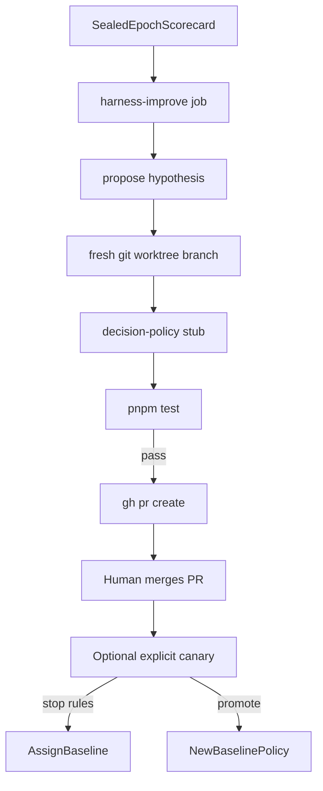

# Harness improvement loop

Not Relative Strength Index. This module turns sealed audit scorecards into
**one** falsifiable decision-policy experiment at a time.

Binding decision: [ADR 005](../adr/005-harness-improvement.md).

## Flow

## Scheduling

| Setting | Default | Meaning |
|---|---|---|
| `harness_improvement.enabled` | `false` | Master switch |
| `harness_improvement.schedule_enabled` | `false` | Allow `harness-improve` job / launchd |
| `harness_improvement.auto_open_pr` | `true` | Push branch + `gh pr create` after green tests |
| `harness_improvement.base_branch` | `main` | PR base |
| `harness_improvement.test_command` | `test:unit` | `pnpm run <script>` in the worktree |
| `harness_improvement.require_two_epochs` | `true` | Need distinct sealed epochs |

Cadence: weekly after audits (launchd `harness-improve`), or `tc run harness-improve` /
`tc harness run`. The job **never merges** and **never starts a canary**.

`evaluateHypothesis` compares sealed **dev vs holdout** epoch scorecards. It does
**not** measure the candidate worktree patch. The scheduled pipeline therefore
must not call it — that would burn holdout without grading the PR. Use
`tc harness evaluate` only when you mean offline epoch gates, not as a schedule
step after `prepare`.

## Rules

- Inputs are sealed aggregates only — no inbox/scraped text in harness prompts.
- Patches limited to hypothesis `allowlistPaths` (decision policy). Forbidden:
  audit maths, router, chat, harness itself, secrets, launchd.
- Candidate canaries may update watchlist/ledger after host validation; all
  external effects are blocked and receipted.
- One active canary when `one_active_experiment` is true.
- Feature defaults **off** until you set `enabled` + `schedule_enabled`.

## CLI

| Command | Effect |
|---|---|
| `tc run harness-improve` / `tc harness run` | Scheduled pipeline → PR |
| `tc harness propose --epoch <id>` | Emit one hypothesis from sealed scorecard |
| `tc harness prepare <id>` | Create confined worktree |
| `tc harness evaluate <id> --dev-epoch … --holdout-epoch …` | Offline gates |
| `tc harness canary start\|stop` | Bounded-live assignment (manual) |
| `tc harness promote <id>` | Record human promotion |
| `tc harness rollback --reason …` | Force baseline assignment |

## Related

- Audit spine: [audit-metrics.md](audit-metrics.md), [orchestrator.md](orchestrator.md)
- Invariants: INV-S23, INV-S24, INV-S25
