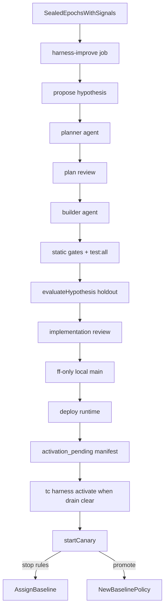

# Harness improvement loop

Not Relative Strength Index. This module turns sealed audit scorecards into
**one** falsifiable decision-policy experiment at a time.

Binding decision: [ADR 005](../adr/005-harness-improvement.md).

## Flow

## Scheduling

| Setting | Default | Meaning |
|---|---|---|
| `harness_improvement.enabled` | `true` | Master switch |
| `harness_improvement.schedule_enabled` | `true` | Allow `harness-improve` job / launchd |
| `harness_improvement.integrate_local_main` | `true` | Fast-forward local `main` after approval |
| `harness_improvement.deploy_runtime` | `true` | Run `ops/install-launchd.sh` after integrate |
| `harness_improvement.defer_agent_activation` | `true` | Schedule stops at pending agent deploy |
| `harness_improvement.test_command` | `test:all` | `pnpm run <script>` in the worktree |
| `harness_improvement.require_two_epochs` | `true` | Need distinct sealed epochs with decision-time signals |
| `harness_improvement.planner_model` / `reviewer_model` / `builder_model` | `composer-2.5` | Agent models |
| `harness_improvement.min_mature_paired` | `40` | Canary maturity floor |
| `harness_improvement.auto_open_pr` | `false` | Deprecated; PR path retired |

Cadence: weekly after audits (launchd `harness-improve`, installed by default;
`--without-harness` to opt out), or `tc harness run`. The scheduled job **never
activates the agent workspace** and **never starts a canary**. Activation is
`tc harness activate <id>` after drain is clear (starts the bounded canary).

Scheduled runs resolve the checkout via `TRENCHCOAT_REPO_ROOT` (set in
`~/.trenchcoat/env` by `install-launchd.sh`), then `process.cwd()`. Launchd does
not set `WorkingDirectory`, so bare `cwd` is often `/` and must not be the only
signal. The path must contain both `.git` and `package.json` (the installed
`~/.trenchcoat/runtime` tree is not a valid harness root).

`evaluateHypothesis` replays the holdout through the candidate worktree policy
(with archived decision-time signals), compares the primary metric to the
development sealed scorecard, and requires protected metrics not to regress.

## Rules

- Inputs are sealed aggregates only — no inbox/scraped text in harness prompts.
- Patches limited to `agent/skills/decision-policy/policy.json`. Forbidden:
  audit maths, router, chat, harness itself, secrets, launchd.
- Candidate canaries may update watchlist/ledger after host validation; all
  external effects are blocked and receipted.
- One active experiment when `one_active_experiment` is true.
- Feature defaults **on** for new schema-11 installs; explicit `false` survives migrate.
- Existing sealed epochs without decision-time `signals` are ineligible until new
  epochs accumulate — enabling the harness may initially produce typed skips.

## Idle gate (redeploy / restart)

`isAgentIdle` is true when nothing is mid-flight: live workspace lock (non-stale),
running incomplete archive runs, research `researching>0`, Telegram research
`running`, or Discord locks/running requests. Abandoned runs and backlog depth
do **not** block idle — they would hang redeploys forever on a busy host.
`wait-idle` first fails orphaned incomplete journals (pre-seal + no lock + ≥30m,
or any running ≥6h) so SIGTERM zombies cannot block forever.

`ops/install-launchd.sh` sets a deploy pause (`~/.trenchcoat/deploy-pause.json`),
bootouts StartInterval jobs, waits for idle (default 30m), reloads launchd, then
clears the pause and kickstarts any deferred job names. While paused, `runJob`
exits 3 and `run-with-lock-retry` waits without burning attempts. Escape hatch:
`--skip-agent-wait`. Operator probe: `tc harness wait-idle`.
`tc run fail <id>` / `tc status --heal-apply` for manual orphan cleanup.

## Drain gate (agent activation)

Full all-work clear requires idle **plus**: lock not stale; research actionable
`=0`; no Telegram confirmations; alpha queue empty; Discord queued/undelivered
clear; no pending X actions; router ingress empty. Abandoned incomplete runs do
not block.

`tc harness activate <id>` waits for idle (unless `--no-wait`), then rechecks the
full drain under the writer lock, syncs only approved instruction paths (never
state/inbox/outbox/reports/alpha-queue), then starts the bounded canary.

## CLI

| Command | Effect |
|---|---|
| `tc run harness-improve` / `tc harness run` | Scheduled pipeline → activation_pending |
| `tc harness propose --epoch <id>` | Emit one hypothesis from sealed scorecard |
| `tc harness prepare <id>` | Create confined worktree (after plan approval) |
| `tc harness evaluate <id> --dev-epoch … --holdout-epoch …` | Offline holdout gates |
| `tc harness wait-idle` | Block until in-flight work finishes |
| `tc harness drain [--wait]` | Print all-work drain snapshot (optional idle wait) |
| `tc harness activate <id>` | Idle-wait + drain-gated agent sync + start canary |
| `tc harness canary start\|stop` | Bounded-live assignment |
| `tc harness promote <id>` | Record promotion after maturity |
| `tc harness rollback --reason …` | Force baseline assignment |

## Related

- Audit spine: [audit-metrics.md](audit-metrics.md), [orchestrator.md](orchestrator.md)
- Invariants: INV-S23, INV-S24, INV-S25
- Agent workspace sync boundary: [agent-workspace.md](agent-workspace.md)
