# The playbook, distilled

Source: Tendychallenge (@TendersAlt) X Article, "The Solana Memecoin Playbook —
the exact framework behind my $450 → $1.1M and $50K → $1.25M challenge"
(2026-07-28). Everything relevant is distilled here. Visual examples live under
[references/](references/README.md).

The author's core claims, in order of importance:

1. **There is no permanent edge.** Setups rotate; the framework is fixed but
   execution adapts. The system's job is regime detection, not one strategy.
2. **Find reasons NOT to trade.** Selection (filtering the universe) matters
   more than entries. Most launches deserve rejection.
3. **Every decision is made before the trade.** Entry, invalidation, targets,
   size — decided cold, executed mechanically. For a human this fights
   emotion; for a bot the pre-trade plan object *is* this rule made literal.
4. **Confluence, never a single signal.** Fib level + trendline + order zone +
   holders + narrative — each additional independent signal raises probability
   and justifies size.
5. **Capital preservation first.** "If I'm wrong, how much am I willing to
   lose?" precedes any upside estimate. Survive to compound.

## Chapter-by-chapter → machine terms

| Playbook chapter | Rule | Pipeline translation |
|---|---|---|
| 1. Tools | Dexscreener charts + X narrative + Fomo holder quality + fast execution (Jupiter/auto-approve) | Existing collectors cover the first three; execution engine is a later phase |
| 2. Finding coins | Same coin appearing on Fomo + Twitter + Dexscreener = attention; review ~150 top charts; min $1M MC; eliminate noise first | Scanner universe + multi-surface convergence flag in the sentiment/context bundle |
| 3. Selection | Narrative that can develop for days + strong holders + influential supporters + multi-event catalyst; criteria must adapt with the market | Weighted confluence scoring; weights are policy knobs the tuning lane can move |
| 4. Chart thesis | Per coin, before entry: fib levels, trendlines, order zones, ideal entry, invalidation, profit targets | The trade-plan contract ([execution-and-risk.md](execution-and-risk.md)) |
| 5. Adapting | "Which setups worked recently? Which stopped?" Trade what the market rewards | Rolling per-setup scoreboard sliced by regime ([promotion-and-tuning.md](promotion-and-tuning.md)) |
| 6. Patterns | Lifecycle A/B/C; first fib retracement; trendline bounces; order-zone reactions | Lifecycle classifier + setup taxonomy ([setups.md](setups.md)) |
| 7. Risk | Size varies by narrative strength, structure cleanliness, liquidity, conviction, invalidation distance, R:R — never uniform | Risk-at-invalidation sizing with conviction tiers |
| 8. Improving | Review wins/losses, adapt as regimes shift | trade-review job + harness audit trail |

His entire manual daily loop — scan hundreds of charts, monitor Twitter, track
wallets, follow narratives, filter scams, maintain a watchlist — is what
trenchcoat already automates. The pipeline adds chapters 4–7: thesis, execution,
risk.

## What the reference charts teach

These are memecoin ("shitter") charts. They are structurally unlike majors:
market-cap-denominated, launched vertically, liquidity-thin, and dominated by a
single impulse + retracement structure. Generic TA assumptions (long history,
mean reversion, clean sessions) do not apply.

### Healthy vs red-flag price action

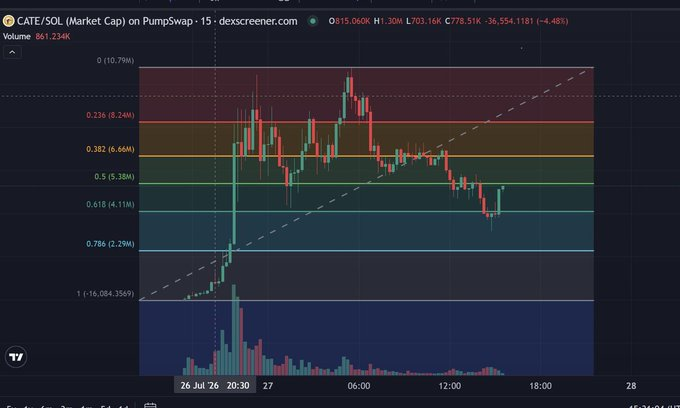

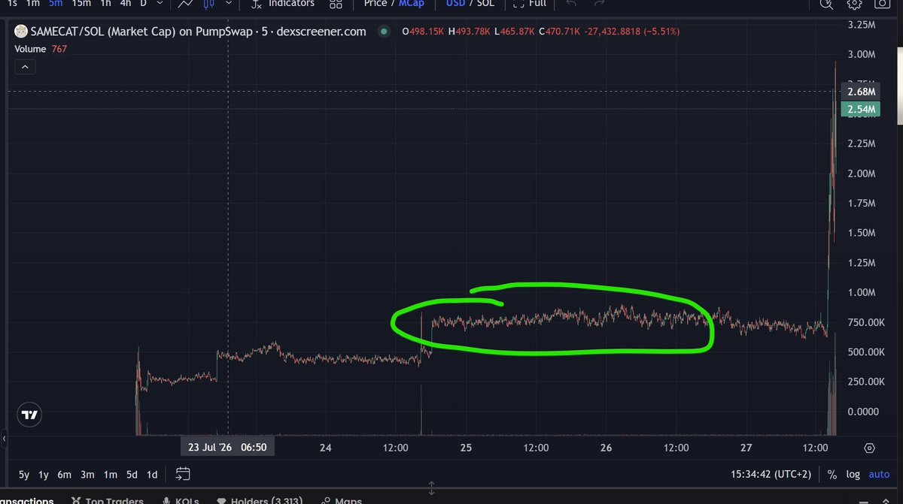

- **Healthy**: violent launch impulse, then *structured* retracement — staged
  pullbacks, declining-volume consolidation, believable two-sided trade.
  Enough structure exists to define fib anchors and an entry/invalidation
  relationship. The launch vertical itself is NOT the signal; the post-launch
  structure is.
- **Red flag**: prolonged thin flat action, then a near-vertical high-volume
  repricing with no staged discovery and no tradable pullbacks. Also: heavy
  Dexscreener boosts, volume-bot signatures, massive candles immediately after
  bonding, "staircase" or up-only-on-nothing shapes.
- Rejection must be **deterministic feature math**, not an image-model vibe:
  price acceleration, one-bar/short-window return extremes, volume
  concentration ratios, wick/range profile, pre-move liquidity, boost flags.
  Feature list in [setups.md](setups.md).

### Lifecycle A / B / C

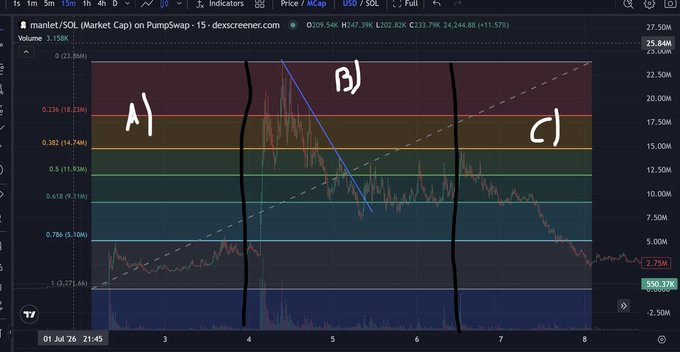

- **A — too early:** launch/discovery. Scams, bundles, whale distribution,
  sudden liquidity drains. No trade by default.
- **B — the sweet spot:** survived the dangerous phase; narrative clearer;
  good holders entering; market structure forming. All v1 setups live here.
- **C — end of trend:** higher lows stop forming, volume fades, narrative
  dies. No new longs; existing plans run their exits. Knowing when a coin no
  longer deserves attention is a first-class output.

### Fibonacci

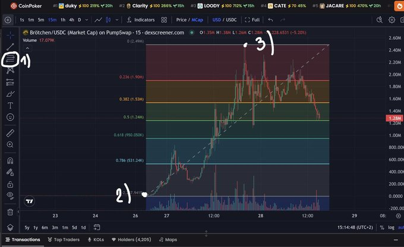

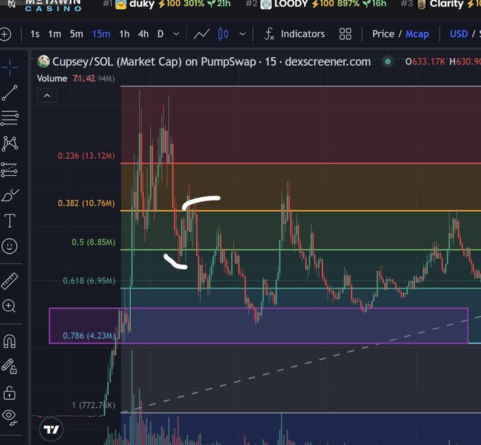

- Anchors: origin of the move (launch / lowest MC before the rally) → current
  all-time high. Redrawn when a new ATH prints.
- The tradable event is the **first** meaningful retracement into a major
  level after a strong new ATH — not any later arbitrary touch.
- Which level holds (0.382 / 0.5 / 0.618 / 0.786) is regime-dependent; at the
  article's time of writing first bounces at 0.5 were working. The level
  preference is a policy knob, never a constant.

### Trendlines

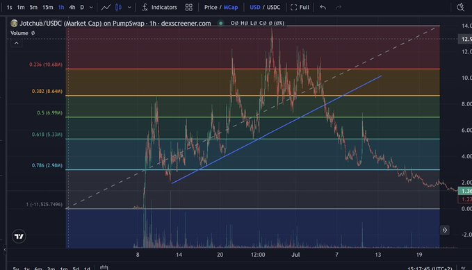

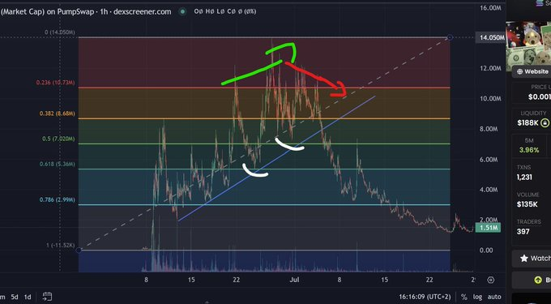

- Validity requires multiple respected touches: one bounce is nothing, two
  interesting, three or more tradable. Each successful defence strengthens it.
- Invalidation is a **decisive close** below the line, not a wick.
- The failure mode is structural: higher lows becoming lower highs. When the
  structure flips, stop trading the line — the market changed, don't force it.

### Downtrend resistance

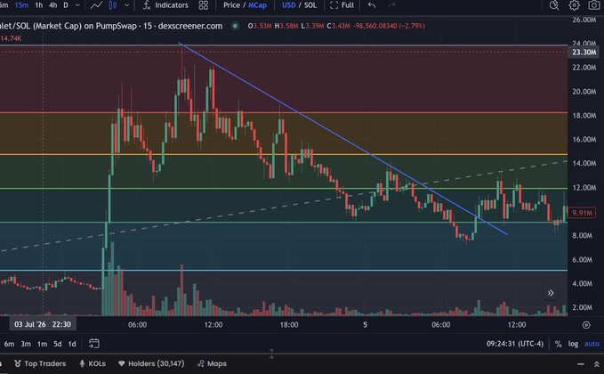

- Connect major swing highs. Used two ways: (1) exits — target sitting just
  below a major downtrend line should be trimmed before resistance; (2)
  entries — a planned buy immediately below strong resistance has poor R:R,
  wait for the deeper retracement. It is a target constraint and a veto, not
  just an entry feature.

### Order zones

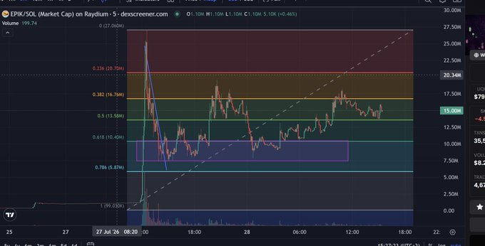

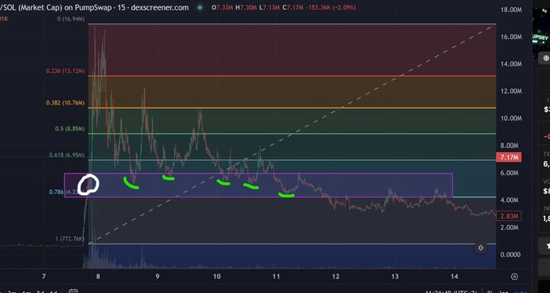

- Areas where buyers and sellers previously agreed on value: post-impulse
  consolidations and prolonged accumulation ranges. Draw a **box**, not a
  line — price reacts within areas.
- Revisits are frequently defended, but repeated retests weaken a zone, and a
  decisive break expires it (and blocks re-entry until new structure forms).

### Holder quality

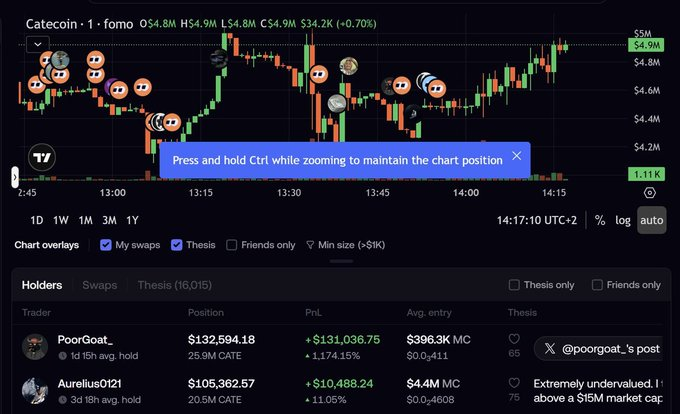

- "Who owns a coin often matters more than who is tweeting about it."
  Conviction (capital at risk) and attention (posting) are distinct evidence
  types; the strongest setups have both.
- In this pipeline that translates to the Smart Money Context projection
  (promoted-cohort participation), not raw Fomo feed access — see
  [design.md](design.md).

## Risk chapter, verbatim rules worth encoding

- Position size derives from: narrative strength, structure cleanliness,
  available liquidity, thesis confidence, invalidation distance,
  upside-vs-downside. Never uniform sizing across trades.
- Losses are inevitable (new chain drains liquidity, BTC dumps, whale exits);
  the only question is whether the book survives them.
- Marathon framing: the objective is to still be here next year with a larger
  portfolio — no forced trades, no chasing candles. The automated equivalent:
  **an explicit no-trade outcome is a success state**, and scan cadence must
  never manufacture exposure.
